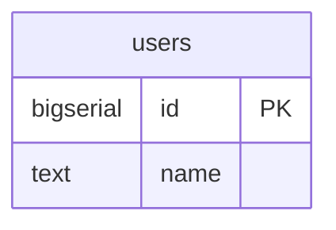
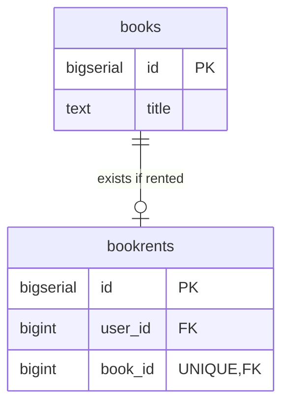

# kmnlib_back

Backend of kmnlib

# Architecture

CQRS + Event Sourcing + Partial Clean Architecture + Minimal Cake Pattern + Actor Model

# Structure

## User

### Snapshot

### Event

| name            | data                      | description          |
|-----------------|---------------------------|----------------------|
| UserCreated     | `{name: String}`          | User is created      |
| UserNameChanged | `{id: i64, name: String}` | User name is changed |
| UserDeleted     | `{id: i64}`               | User is deleted      |

## Book

### Snapshot

### Event

| name         | data                              | description      |
|--------------|-----------------------------------|------------------|
| BookCreated  | `{title: String}` | Book is created  |
| BookRented   | `{ book_id: i64, user_id: i64 }`  | Book is rented   |
| BookReturned | `{ book_id: i64, user_id: i64 }`  | Book is returned |
