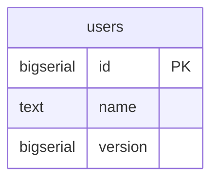
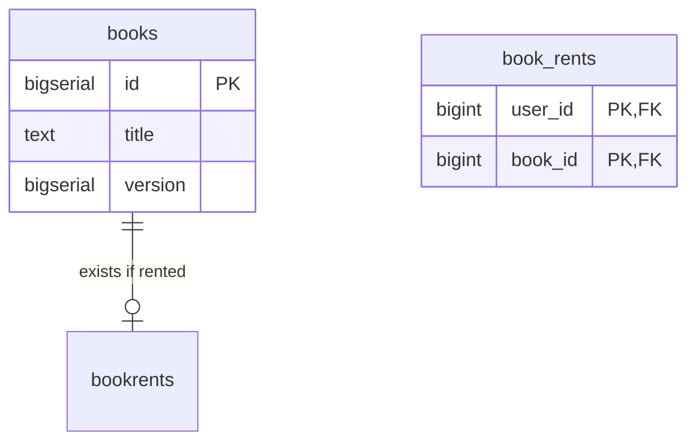

# kmnlib_back

Backend of kmnlib

# Architecture

CQRS + Event Sourcing + Partial Clean Architecture + Minimal Cake Pattern + Actor Model

# Structure

## User

### Snapshot



### Event

| name            | data                      | description          |
|-----------------|---------------------------|----------------------|
| UserCreated     | `{name: String}`          | User is created      |
| UserNameChanged | `{id: i64, name: String}` | User name is changed |
| UserDeleted     | `{id: i64}`               | User is deleted      |

## Book

### Snapshot



### Event

| name         | data                                             | description      |
|--------------|--------------------------------------------------|------------------|
| BookCreated  | `{title: String}`                                | Book is created  |
| BookRented   | `{book_id: i64, user_id: i64, rev_version: i64}` | Book is rented   |
| BookReturned | `{book_id: i64, user_id: i64, rev_version: i64}` | Book is returned |
| BookDeleted  | `{book_id: i64}`                                 | Book is deleted  |

# DB

## SnapShot

PostgreSQL

```shell
podman run --rm --name kmnlib-postgres -v ./migrations/20231125184100_init.sql:/docker-entrypoint-initdb.d/postgre.sql -e POSTGRES_PASSWORD=develop -p 5432:5432 docker.io/postgres
```
## Event

EventStoreDB

```shell
podman run --rm -it --name kmnlib-eventstore -p 2113:2113 -p 1113:1113 docker.io/eventstore/eventstore:latest --insecure --run-projections=All --enable-external-tcp --enable-atom-pub-over-http
```