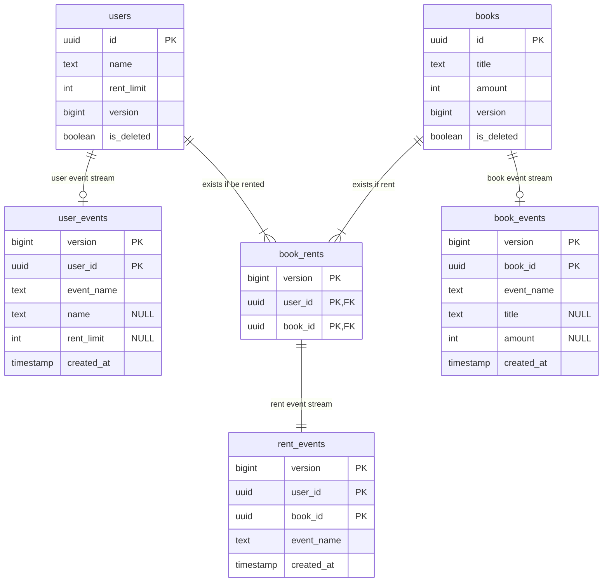

# kmnlib_back

Backend of kmnlib

This project is a playground to compare with [architectured](https://github.com/HalsekiRaika/architectured).

# Architecture

CQRS + Event Sourcing + Partial Clean Architecture + Minimal Cake Pattern + Actor Model

# Structure



### Event

| name        | data                                                        |
|-------------|-------------------------------------------------------------|
| UserCreated | `{name: String, rent_limit: i31}`                           |
| UserUpdated | `{id: UUID, name: Option<String>, rent_limit: Option<i32>}` |
| UserDeleted | `{id: UUID}`                                                |

| name        | data                                                          |
|-------------|---------------------------------------------------------------|
| BookCreated | `{title: String, amount: i32}`                                |
| BookUpdated | `{book_id: UUID, title: Option<String>, amount: Option<i32>}` |
| BookDeleted | `{book_id: UUID}`                                             |

| name         | data                                                     |
|--------------|----------------------------------------------------------|
| BookRented   | `{user_id: UUID, book_id: UUID, expected_version: UUID}` |
| BookReturned | `{user_id: UUID, book_id: UUID, expected_version: UUID}` |

# DB

PostgreSQL

```shell
podman run --rm --name kmnlib-postgres -v ./migrations/20231125184100_init.sql:/docker-entrypoint-initdb.d/postgre.sql -e POSTGRES_PASSWORD=develop -p 5432:5432 docker.io/postgres
```