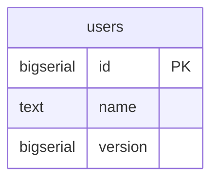
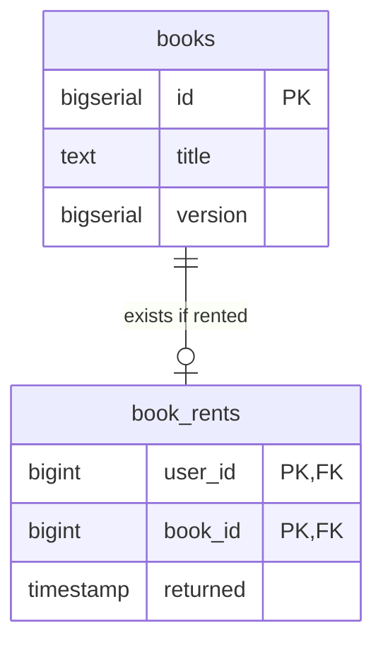
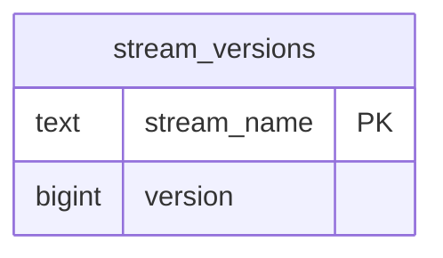

# kmnlib_back

Backend of kmnlib

# Architecture

CQRS + Event Sourcing + Partial Clean Architecture + Minimal Cake Pattern + Actor Model

# Structure

## User

### Snapshot



### Event

| name        | data                              |
|-------------|-----------------------------------|
| UserCreated | `{name: String}`                  |
| UserUpdated | `{id: i64, name: Option<String>}` |
| UserDeleted | `{id: i64}`                       |

### EventStream

- `User-{id}`

## Book

### Snapshot



### Event

| name        | data                                    |
|-------------|-----------------------------------------|
| BookCreated | `{title: String}`                       |
| BookUpdated | `{book_id: i64, title: Option<String>}` |
| BookDeleted | `{book_id: i64}`                        |

| name         | data                                                  |
|--------------|-------------------------------------------------------|
| BookRented   | `{user_id: i64, book_id: i64, expected_version: i64}` |
| BookReturned | `{user_id: i64, book_id: i64, expected_version: i64}` |

### EventStream

- `Book-{id}`
- `BookRent`

## StreamVersions



# DB

## SnapShot

PostgreSQL

```shell
podman run --rm --name kmnlib-postgres -v ./migrations/20231125184100_init.sql:/docker-entrypoint-initdb.d/postgre.sql -e POSTGRES_PASSWORD=develop -p 5432:5432 docker.io/postgres
```

## Event

EventStoreDB

```shell
podman run --rm -it --name kmnlib-eventstore -p 2113:2113 -p 1113:1113 docker.io/eventstore/eventstore:latest --insecure --run-projections=All --enable-external-tcp --enable-atom-pub-over-http
```